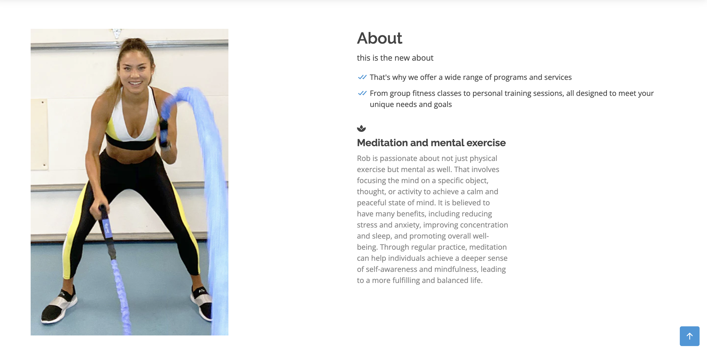

# Live Long, Live Strong Fitness

Welcome to Live Long, Live Strong Fitness - a health, wellness, and fitness website designed to help you achieve your fitness goals and live a healthy lifestyle. Our aim is to provide you with the best information and resources to help you make positive changes to your health and fitness.

## Technologies Used
This website is built using Django - a high-level Python web framework that encourages rapid development and clean, pragmatic design. Django provides a powerful toolkit for building complex web applications, and is widely used by developers around the world.

## Features
### 1. Personalized Fitness Plans Blog - 
Our certified trainers will work with you to create a customized fitness plan that is tailored to your specific needs and goals.
### 2. Nutritional Guidance Blog - 
We provide nutritional guidance and advice to help you make healthier food choices and achieve your fitness goals faster.
### 3. Group Fitness Classes - 
Join our community of fitness enthusiasts and participate in group fitness classes led by our certified trainers.
### 4. Health and Wellness Resources - 
Our website provides a wealth of health and wellness resources, including articles, videos, and podcasts, to help you stay informed and inspired on your fitness journey.

## Getting Started
To get started with Live Long, Live Strong Fitness, simply create an account on our website and start exploring! You can sign up for a personalized fitness plan, join a group fitness class, or browse our health and wellness resources to find the information you need to achieve your fitness goals.

## Contact Us
If you have any questions or feedback about Live Long, Live Strong Fitness, please don't hesitate to get in touch with us. You can reach us through our website, or by emailing our support team at support@livelonglivestrongfitness.com.

Thank you for choosing Live Long, Live Strong Fitness! We look forward to helping you achieve your fitness goals and live a healthier, happier life.

